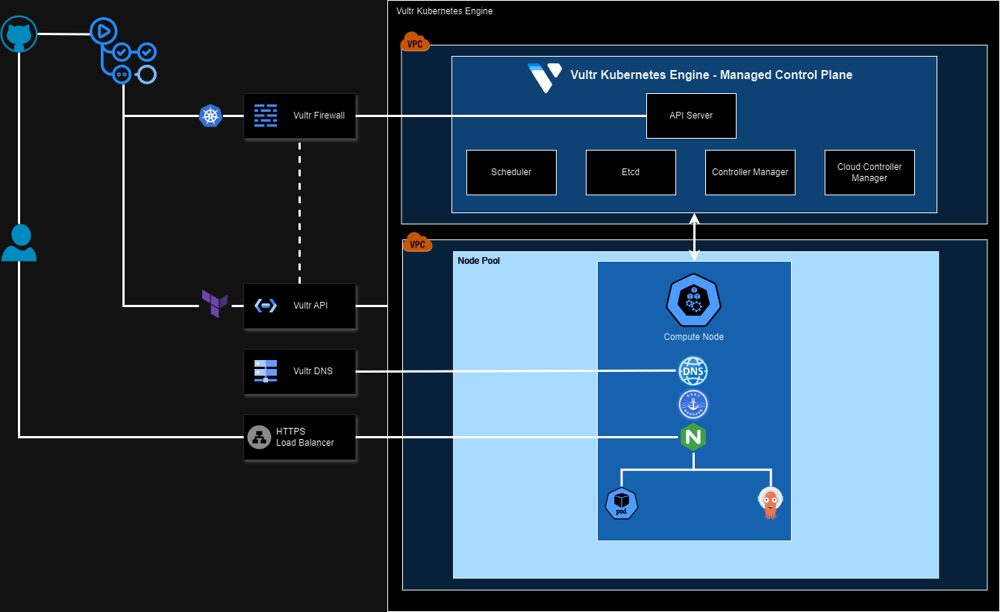

# vultr_vke
This repository deploys a Vultr Kubernetes Engine (VKE) using Terraform, deploys and configures Cert-Manager, External-DNS, Nginx-ingress and ArgoCD.

## Requirements
Github Actions is used to orchestrate the process.  The following GitHub secrets and variables are referenced in the workflow:
|Secret Name|Purpose|
|-----------|-------|
|VULTR_API_KEY|Used by Terraform to connect with Vultr to create resources|
|AWS_ACCESS_KEY|Object Storage Credentials to store Terraform state file|
|AWX_SECRET_ACCESS_KEY|Object Storage Credentials to store Terraform state file|

Variables used to configure non-sensitive values:
|Veriable Name|Purpose|
|-------------|-------|
|EXTERNAL_DNS_DOMAIN_NAME|Configures External-DNS domain name filter|

